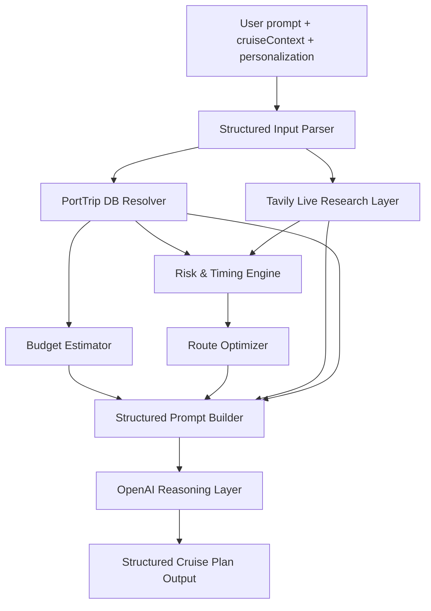

# PortTrip Hybrid Intelligence Cruise Engine

## API Flow Diagram

## Tavily Integration File

- `app/api/chat/tavily.js`

## OpenAI Prompt Structure

System contract enforces:
1. Port Summary Snapshot
2. Time-Optimized Itinerary Table
3. Budget Comparison
4. Return-to-Ship Safety Logic
5. Hidden Local Add-On

Prompt priority:
- Database context (authoritative base)
- Live Tavily updates (fresh operational constraints)
- Reasoning for route ordering and contingencies

## Database Schema (Operational)

Implemented in `app/data/cruise-db.json`:
- `ports[]`
  - `name`
  - `cruise_terminal_location`
  - `tender`
  - `average_transfer_time_minutes`
  - `high_risk_traffic_hours`
  - `common_scams`
  - `must_see_spots`
  - `walkability_score`
  - `distance_to_city_center_km`
  - `attractions[]`
  - `restaurants[]`
- `attractions[]`
  - `name`
  - `location_coords`
  - `average_visit_time_minutes`
  - `entrance_fee_eur`
  - `crowd_peak_hours`
  - `category`
  - `distance_from_terminal_km`
- `restaurants[]`
  - `near_terminal_flag`
  - `avg_price_eur`
  - `cuisine_type`

## Risk Engine Logic

Risk score factors:
- Traffic window overlap
- Tender operations risk
- Live strike/closure signals
- Available port-day time window

Thresholds:
- Low: <40
- Medium: 40–64
- High: >=65

Safe return time:
- `all_aboard - (75 min base + tender delay if applicable)`

## Example Improved Barcelona Output (excerpt)

- Port Summary Snapshot includes dock type, city distance, travel time, risk level, and must-return-by time.
- Itinerary blocks include transit cost/minutes + reason-for-ordering.
- Budget section compares ship excursion vs DIY estimate and savings.
- Safety section itemizes traffic + congestion + tender buffers.
